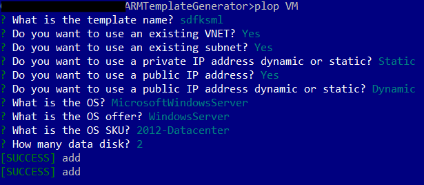

= ARMTemplateGenerator
ifdef::env-github[]
:imagesdir: https://raw.githubusercontent.com/r3dlin3/ARMTemplateGenerator/master/
:tip-caption: :bulb:
:note-caption: :information_source:
:important-caption: :heavy_exclamation_mark:
:caution-caption: :fire:
:warning-caption: :warning:
endif::[]
ifndef::env-github[]
:imagesdir: ./
endif::[]
:toc:
:toc-placement!:

== What is ARMTemplateGenerator?

ARMTemplateGenerator is a CLI to generate ARM templates. 

It is based on plop. Instead of a ton of parameters, the CLI will ask questions to generate the ARM template and its associated parameter file.

At this moment, ARMTemplateGenerator supports:

* Azure App Service
* Azure Function
* Azure Data Lake Store (v1)
* Azure Key Vault
* Azure Kubernetes Service
* Azure Container Registry
* Azure SQL
* Azure Database for MySQL
* Recovery Services Vault
* Storage Account & Data Lake Storage Gen2
* VM

=== Why create or use ARMTemplateGenerator?

ARM template supports condition or loops however conditions or loops have a number of limitations:

* Loops does not support 0. You must have at least one element.
* In a "if" statement, both statements (in case of true or false) are evaluated, resulting on complex tricks to prevent errors

Moreover, the use of nested templates are way too complicated:

* By nature, they need to be uploaded somewhere, which is not as straight forward as Terraform files which are all included
* 2 nested template (one template for NIC with or without public IP for instance) would need to share the same "interface", the same parameters.
What's the point having a public DNS name without a public IP?

Finally, VM are quite complex (lots of objects). 
So by using such generator as this one, answering questions on what you want to do, you would be able to have a template following best practices, without to copy-paste template and refactoring for your needs.

toc::[]

== Getting Started

=== Installation
1. Clone the repo

    git clone https://github.com/r3dlin3/ARMTemplateGenerator

2. Install dependencies

    $ yarn install
or
    $ npm install

3. Install plop globally

    $ yarn global add plop
or
    $ npm install -g plop

4. Check plop's version

----
> plop -v
2.4.0
----

=== Generate a VM ARM template
----
plop VM
----
And answers the question

== Example

And the generated file: 

* link:assets/abcd.json[The ARM template]
* link:assets/abcd.parameters.json[The parameters]

== Built-In Actions

A few actions has been added in addition of the https://plopjs.com/documentation/#built-in-actions[built-in actions of plopjs].

`printHelpDeployment`:: Display help messages for deploying ARM templates

== Built-In Helpers

A few helpers have been added for the templates in addition of the https://plopjs.com/documentation/#built-in-helpers[helpers provided by plopjs].

`repeat`:: Repeat a block based on an integer. Example:
----
{{#repeat count=nbDataDisk}}
    {
        "diskSizeGB": "[parameters('sizeOfEachDataDiskInGB')]",
        "lun": {{@index}},
        "createOption": "Empty"
    }{{#unless @last}},{{/unless}}
{{/repeat}}
----
`is`:: Test equality with a value (string or integer). Example:
----
{{#is privateIPtype "Static"}}
"privateIP": {
    "type": "string",
    "metadata": {
        "description": "Static private IP"
    }
},
{{/is}}
----
`isnot`:: The reverse of `is`

== How to contribute

For new modules, a generator "Generator" has been created:

----
> plop Generator "Azure Backup"
√  ++ \templates\AzureBackup\azuredeploy.json
√  ++ \templates\AzureBackup\azuredeploy.parameters.json
√  ++ \templates\AzureBackup\component.js
----

== Reminder

=== Deploy a template using PowerShell Az
1) Login to Azure
----
Login-AzAccount
Get-AzSubscription
Set-AzContext -SubscriptionId <subscription ID>
----
Or 
----
Import-AzContext -Path tomycontext
----
2) Create a resource group
----
$rg="myrg"
New-AzResourceGroup $rg -Location "West Europe"
----
3) Deploy
----
New-AzResourceGroupDeployment -ResourceGroupName $rg -TemplateFile .\generated\mytemplate.json -TemplateParameterFile .\generated\mytemplate.parameters.json -verbose
----

=== Deploy a template using PowerShell AzureRM
1) Login to Azure
----
Login-AzureRmAccount
Get-AzureRmSubscription
Set-AzureRmContext -SubscriptionId <subscription ID>
----
Or 
----
Import-AzureRmContext -Path tomycontext
----
2) Create a resource group
----
$rg="myrg"
New-AzureRmResourceGroup $rg -Location "West Europe"
----
3) Deploy
----
New-AzureRmResourceGroupDeployment -ResourceGroupName $rg -TemplateFile .\generated\mytemplate.json -TemplateParameterFile .\generated\mytemplate.parameters.json -verbose
----

== TODO

* VM: add Azure Key Vault support
* SQL: Add georeplication support
* SQL: Add TDE encryption with Key Vault
* SQL: Add Long-Term backup
* AKS

